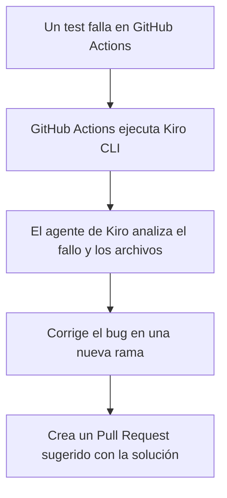

# Kiro IDE Avanzado: Hooks, Protocolo MCP y el Bucle de Verificación

En mi artículo anterior, vimos cómo Kiro IDE introduce el desarrollo guiado por especificaciones (Spec-Driven Development) para trabajar mano a mano con agentes de inteligencia artificial. Pero seamos sinceros: usar la IA para que escriba funciones sencillas o helpers es solo rascar la superficie.

Donde Kiro realmente brilla es cuando empezamos a tratar a sus agentes como ingenieros de software autónomos que interactúan con nuestro entorno de desarrollo y sistemas de integración continua (CI/CD). 

Hoy vamos a sumergirnos en las características más avanzadas de Kiro y cómo puedes implementarlas en tus proyectos reales.


---

## 1. Agent Hooks: Automatizando el Trabajo Sucio

¿Te ha pasado alguna vez que escribes código, lo guardas, y 10 minutos después te das cuenta de que rompiste el formateo o de que olvidaste documentar una función nueva? Los **Agent Hooks** están diseñados para solucionar esto de forma proactiva.

Básicamente, los hooks son "disparadores" o eventos dentro del IDE que le dicen a un agente que realice una acción específica en segundo plano. Puedes configurarlos en un archivo local `.kiro/hooks.json`.

Por ejemplo, aquí tienes una configuración típica para generar documentación automáticamente cada vez que se crea un nuevo archivo de componente:

```json
{
  "hooks": [
    {
      "event": "onFileCreate",
      "filter": "src/components/**/*.tsx",
      "action": "generate_docs",
      "prompt": "Genera comentarios JSDoc estructurados para el nuevo componente y asegúrate de exportar correctamente los tipos de las Props."
    }
  ]
}
```

Al guardar el archivo, Kiro ejecuta un agente especializado que lee tu nuevo componente, analiza sus propiedades y agrega la documentación correspondiente sin que tengas que pedírselo explícitamente.

---

## 2. Protocolo MCP (Model Context Protocol)

Uno de los mayores límites de las IAs tradicionales es la falta de contexto en tiempo real del ecosistema externo. Si tu base de datos PostgreSQL tiene una estructura específica o si tus logs se guardan en un servidor cloud, el agente está "ciego" ante ello.

Kiro soluciona este aislamiento mediante el soporte nativo de **Model Context Protocol (MCP)**. MCP es un protocolo abierto que actúa como un puente seguro entre el agente de IA y herramientas o fuentes de datos locales y remotas.

Gracias a esto, puedes conectar tu agente de Kiro a:
*   **Bases de Datos:** Permitir al agente consultar directamente el esquema de base de datos para generar consultas SQL exactas.
*   **APIs Externas:** Darle acceso a la documentación actualizada de tu API interna o de servicios como Stripe.
*   **Terminales Seguras:** Ejecutar scripts específicos del proyecto para validar integraciones antes de dar por buena una tarea.

---

## 3. El Bucle de Verificación (Verification Loop)

Cualquiera puede hacer que una IA genere código que *parezca* correcto. Pero, ¿realmente funciona bajo casos extremos (edge cases)?

Kiro introduce el concepto de **Verification Loop** (Bucle de Verificación). A diferencia del flujo tradicional donde solo se ejecutan tus tests unitarios estáticos, Kiro utiliza razonamiento automatizado y pruebas basadas en propiedades (similares al fuzz testing).

Cuando el agente termina de escribir una función:
1.  **Analiza la Spec:** Revisa la especificación inicial para entender el "contrato" de la función (ej. *"debe retornar un valor entero positivo mayor a cero"*).
2.  **Genera Datos de Prueba Extremos:** Envía valores vacíos, nulos, strings gigantescos o números negativos para intentar romper la función.
3.  **Refactoriza Automáticamente:** Si la función falla ante algún caso de prueba, el agente analiza el error, corrige el código y repite el proceso hasta que es 100% robusto.

Esto te da la tranquilidad de que el código generado no solo pasa tus tests básicos de "camino feliz", sino que está preparado para producción.

---

## 4. Kiro CLI: Agentes en tu Pipeline de CI/CD

El poder de Kiro no se limita a su interfaz visual (la aplicación de escritorio). Kiro incluye una interfaz de línea de comandos (CLI) que te permite correr agentes en modo "headless" (sin interfaz gráfica).

Esto abre la puerta a flujos de trabajo alucinantes en tus pipelines de GitHub Actions. Imagina el siguiente flujo:



Puedes invocar al agente en tu servidor de integración continua ejecutando un comando sencillo:

```bash
kiro agent run --task "Investiga la falla en el test unitario de login y propón una corrección" --verify
```

El agente clonará la rama, reproducirá el error, buscará la solución, verificará que el test ahora pase y subirá los cambios. Todo de forma transparente.

---

## Conclusión

El paso de "copilotos de código" a "agentes autónomos" está ocurriendo ahora mismo. Kiro IDE demuestra que cuando combinamos la flexibilidad de un editor clásico con la rigurosidad del Spec-Driven Development, los Agent Hooks y la verificación automatizada, podemos programar con una velocidad y seguridad que antes parecían de ciencia ficción.

Si eres desarrollador, te recomiendo empezar a experimentar con estas características avanzadas. Tu forma de programar nunca volverá a ser la misma.
